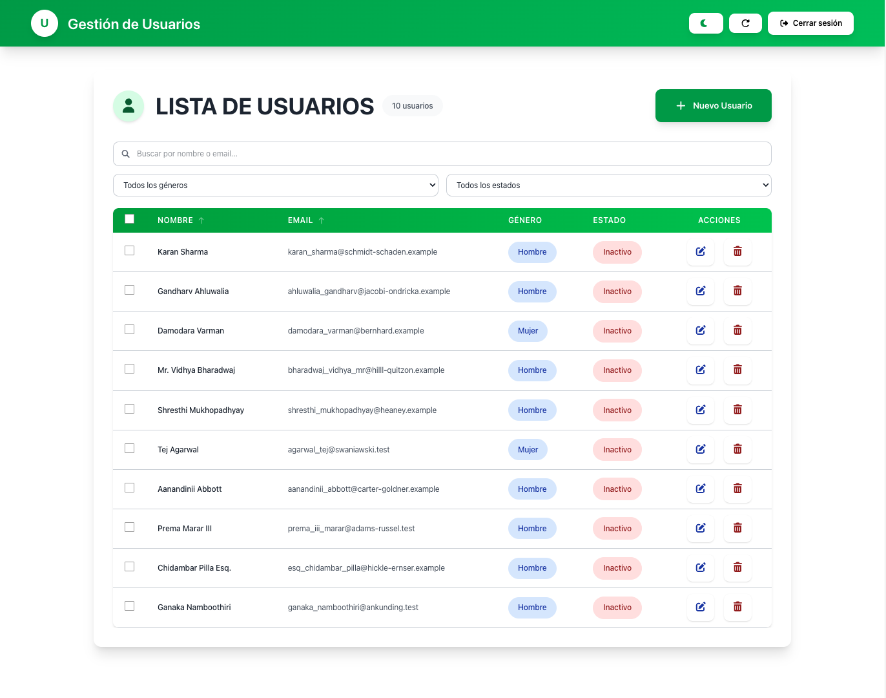
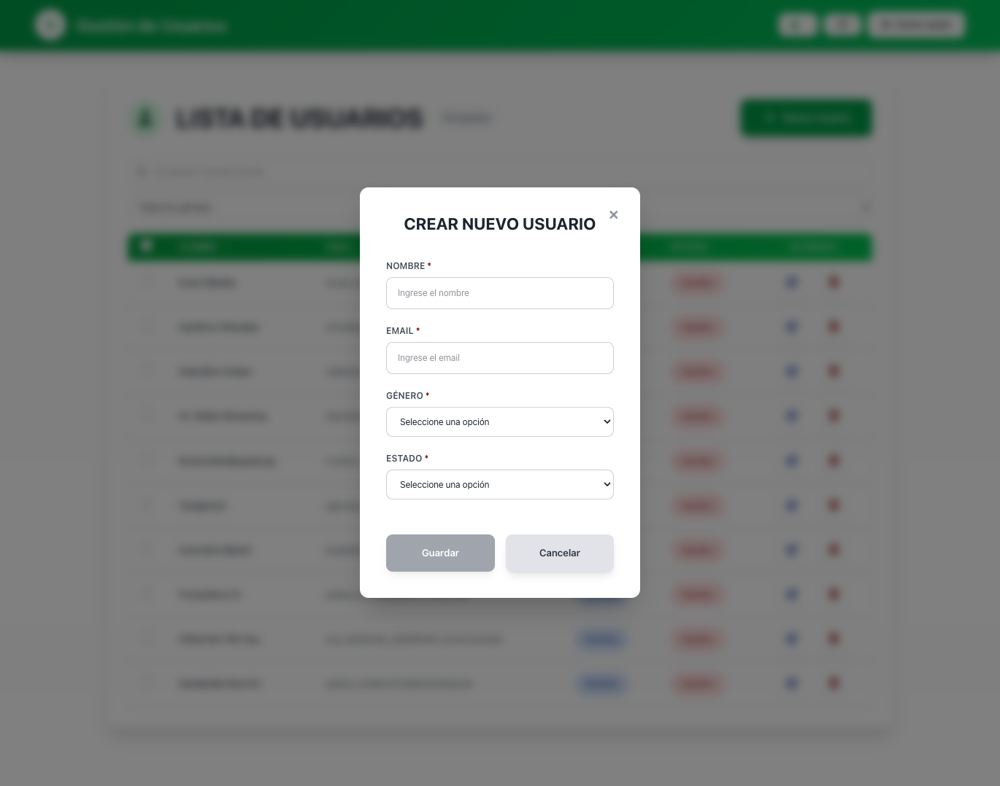
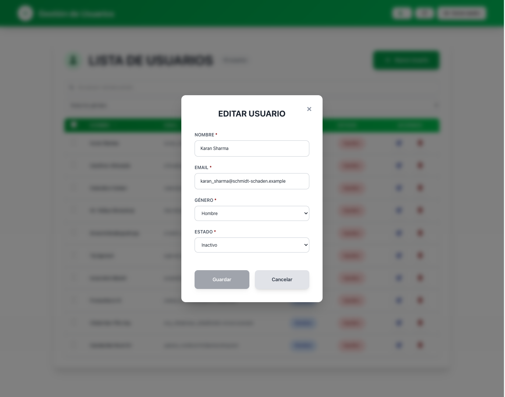
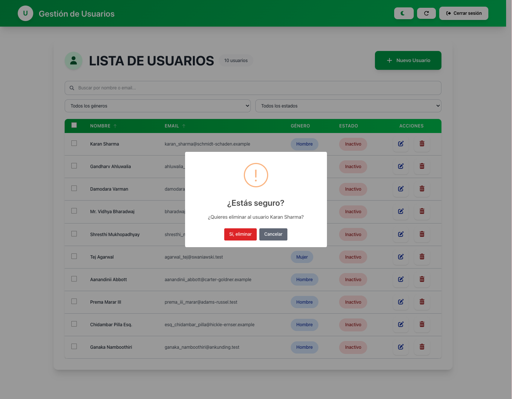
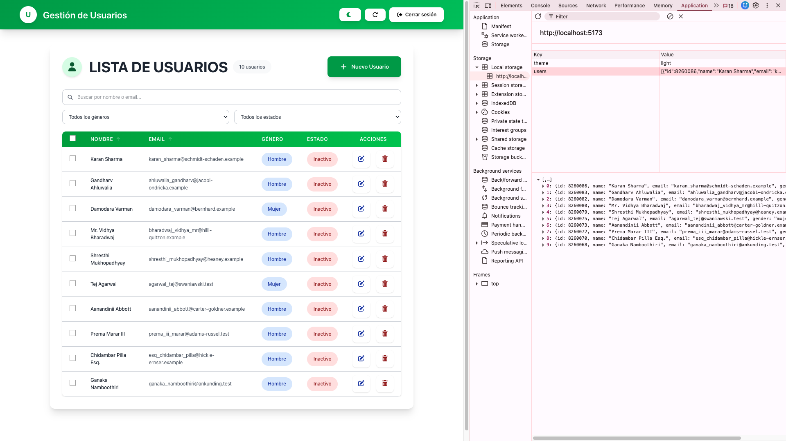
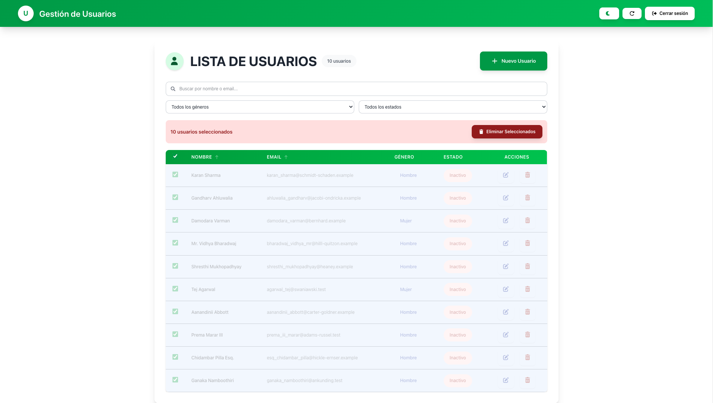
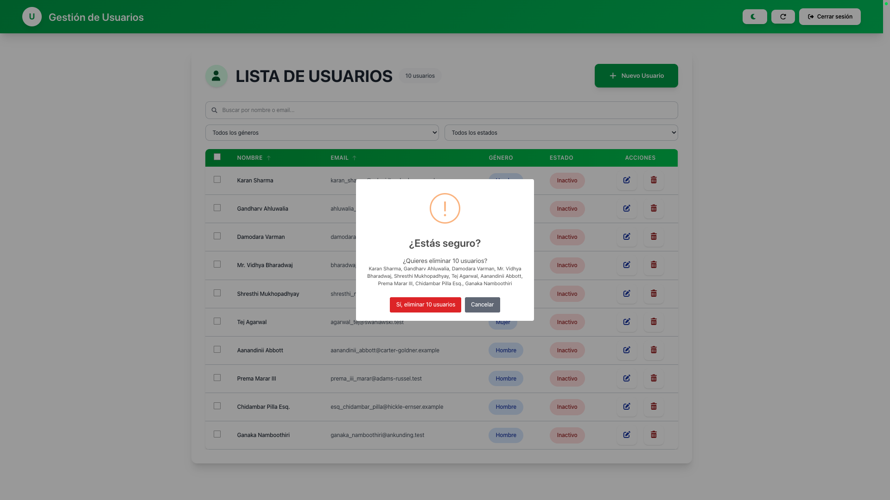
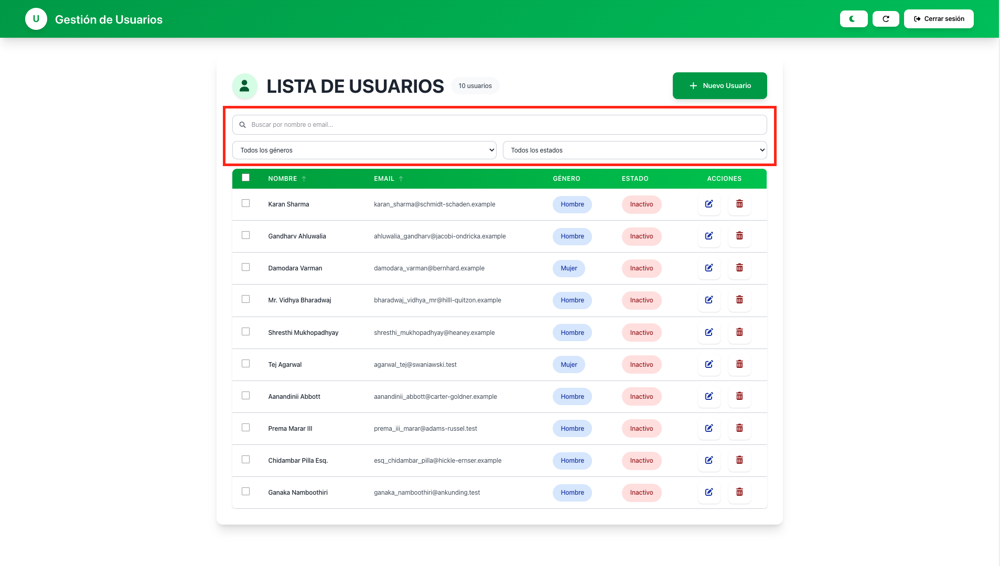
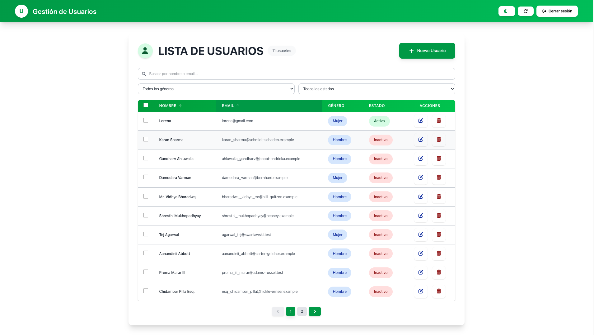
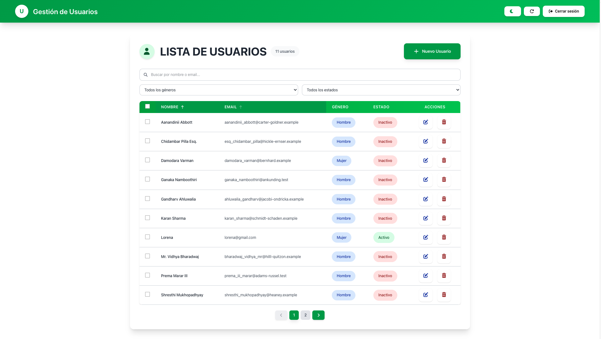

# React + TypeScript + Vite

Un entorno moderno, rápido y eficiente para construir aplicaciones web escalables utilizando React, TypeScript y Vite
como bundler principal.

# Características principales

## Vite como servidor de desarrollo ultrarrápido

## React 19 con soporte para el nuevo React Compiler

## TypeScript para tipado seguro

## TailwindCSS para estilos basados en utilidades

## ESLint y reglas específicas para un código más limpio

# React Compiler

Este proyecto está preparado para aprovechar el nuevo compilador de React, el cual ofrece:

## Mejor detección de dependencias en funciones

## Optimización automática sin necesidad de useMemo o useCallback

## Mejor rendimiento en renderizados

## Código más limpio y menos dependiente de optimizaciones manuales

# Instalación y ejecución

## Instalar dependencias

npm install

## Ejecutar en modo desarrollo

npm run dev

# Tecnologías utilizadas

## React 19

## TypeScript

## Vite

## TailwindCSS

## React Compiler

## ESLint

## FontAwesome

## Formik + Yup

## SweetAlert

# FUNCIONALIDADES

Utiliza React para implementar la interfaz de usuario y las funcionalidades requeridas.

## 1. Emplea el siguiente API para obtener los datos de los usuarios:

https://gorest.co.in/public/v2/users

## 2. Los datos de los usuarios deben ser presentados de manera organizada en una tabla.

## 3. Utiliza un estado global para almacenar la información de los usuarios y asegurar su disponibilidad a lo largo de la aplicación.

## 4. Implementa las siguientes operaciones CRUD (Crear, Leer, Actualizar, Eliminar) para los usuarios:
### CREAR USUARIO

### ACTUALIZAR USUARIO

### ELIMINAR USUARIO

## 5. 6. Leer: Mostrar los usuarios en la tabla al cargar la página.

      Crear un formulario reutilizable que permita la creación y actualización de la información
      de los usuarios y se refleje en la tabla.

## 7. 8. 9. Los campos deben contener validaciones de acuerdo al tipo de dato y no estar vacios

         Eliminar: Borrar un usuario y actualizar la tabla en consecuencia.
         No es necesario llamar al API para las acciones de crear, actualizar, eliminar, se lo debe hacer
         solo a la información del estado global

## 10. La información de los usuarios debe persistir incluso al recargar la página.

## 11. Agrega un botón especial que permita eliminar todos los usuarios almacenados en el estado
    global y obtener

## Adicionales

## Filtros por nombre o email, todos los generos y todos los estados.

## Paginación de resultados.

## Ordenar por nombre o email.

